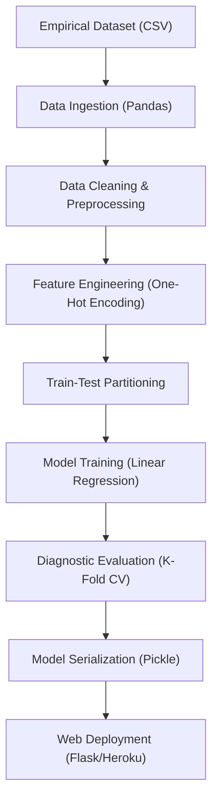

# Technical Specification: Bangalore House Price Prediction

## Architectural Overview

**Bangalore House Price Prediction** is a predictive analytics application designed to estimate real estate prices in Bangalore based on key property features. The project serves as a practical implementation of end-to-end machine learning pipelines and web deployment, established during a Training and Internship in Data Analytics, Machine Learning and AI using Python conducted by Advitiya IIT Ropar and Diginique TechLabs.

### Data Science Pipeline

---

## Technical Implementations

### 1. Modeling Architecture
-   **Core**: Built on **Scikit-learn**, utilizing `LinearRegression` for price estimation.
-   **Estimation Logic**: Establishing a multivariate relationship between independent variables (Location, Sqft, BHK, Bath) and the dependent variable (Price).
-   **Optimization**: Includes dimensionality reduction and outlier removal logic to enhance model accuracy.

### 2. Evaluation & Validation
-   **Metrics**: Implements K-Fold Cross Validation and Grid Search CV to optimize model parameters and ensure robustness.
-   **Reproducibility**: Utilizes standard preprocessing steps to ensuring consistent input transformation for both training and inference.

### 3. Developmental Infrastructure
-   **Notebook Runtime**: The primary research was conducted in **Jupyter Notebook**, leveraging Python's data science stack.
-   **Production**: The analytical kernel is serialized into a pickle file (`bangalore_home_prices_model.pickle`) and served via a **Flask** REST API.

---

## Technical Prerequisites

-   **Runtime**: Python 3.7+ environment.
-   **Backend**: Flask Web Framework.
-   **Dependencies**: `pandas`, `numpy`, `matplotlib`, `scikit-learn`, `flask`.

---

*Technical Specification | Data Science | Version 1.0*
