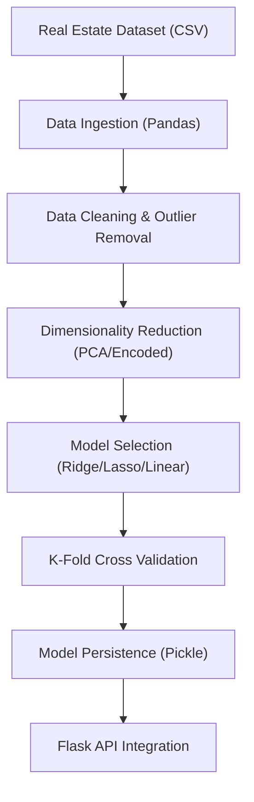

# Technical Specification: House Price Prediction

## Architectural Overview

**Bangalore House Price Prediction** is a predictive modeling study designed to demonstrate the application of multivariate regression in estimating real estate values. The project serves as a digital exploration into machine learning heuristics for property valuation, established during a Machine Learning internship program at IIT ROPAR - Diginique Techlabs.

### Analytics Pipeline

---

## Technical Implementations

### 1. Modeling Architecture
-   **Core**: Built on **Scikit-learn**, utilizing `LinearRegression`, `Lasso`, and `Ridge` variants for robust price estimation.
-   **Estimation Logic**: Establishing a multivariate relationship between independent features (Location, BHK, Sqft) and the dependent variable (Price) to minimize Root Mean Squared Error (RMSE).

### 2. Evaluation & Validation
-   **Metrics**: Implements a rigorous evaluation strategy using **GridSearchCV** for hyperparameter tuning and **K-Fold Cross Validation** to ensure model generalization.
-   **Reproducibility**: Utilizes systematic data cleaning pipelines (removing dimensionally rare locations) to ensure consistent analytical boundaries.
-   **Heuristics**: Scalable prediction logic encapsulated in a python server to process real-time user queries.

### 3. Developmental Infrastructure
-   **Notebook Runtime**: The primary research was conducted in **Jupyter Notebook**, exploring feature engineering techniques and model comparisons.
-   **Source Production**: The analytical kernel is deployed via a **Flask Server**, bridging the gap between statistical modeling and end-user application.

---

## Technical Prerequisites

-   **Runtime**: Python 3.7+ environment (Local or Cloud-based).
-   **Dependencies**: `pandas`, `numpy`, `matplotlib`, `scikit-learn`, and `flask` libraries.

---

*Technical Specification | Machine Learning | Version 1.0*
